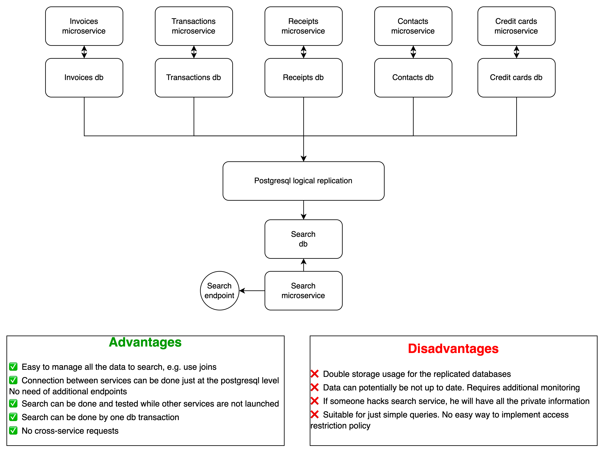
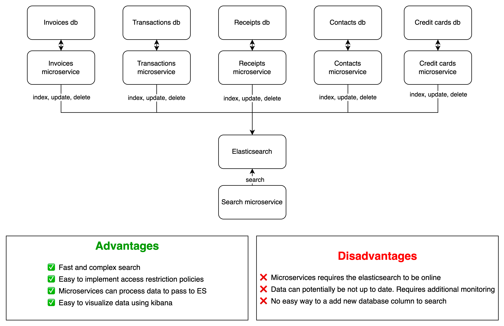
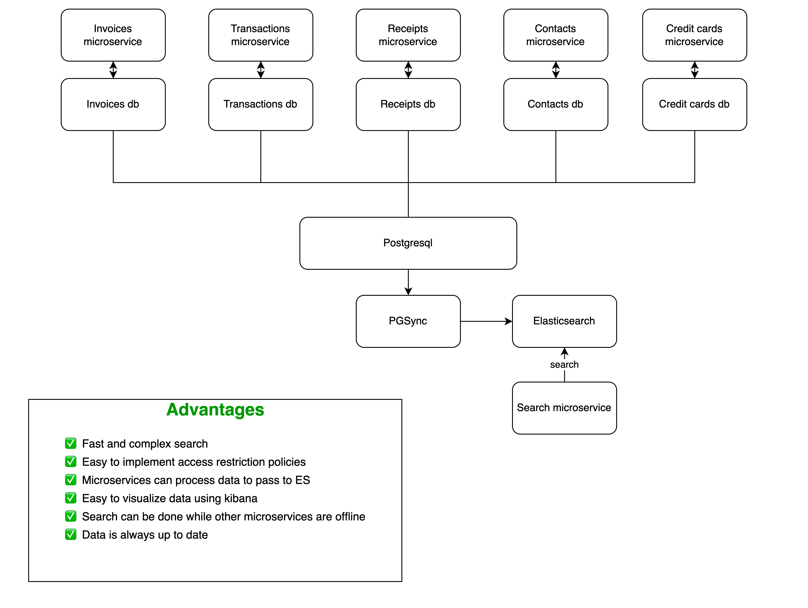

# The task
## Context
We have a set of microservices: invoices, transactions, receipts, contracts, and credit cards. Each service works in a separate container and talks to a separate database.

## Task
Our users have to be able to search the data stored in all of these services.

You have to create an architecture of Search service that

- is handling all information from all these microservices
- the information in the search service has to be kept up to date (in case something is changing in other microservices, the search data has to follow changes)
- Some users have access restriction policies. For example, some users are not allowed to see some invoices or contracts — hence these **users should not see**  documents with restricted access in search  results

## How to prepare a solution
- Please create a diagram describing your architectural solution. Include all services, servers, databases, and other components you will be using.
- Please name all databases, software frameworks, and other pre-made solutions you will be using in this project. Explain your choice in a couple of paragraphs.
- If it feels appropriate, explain your architecture in a couple of sentences of text. You may be describing algorithms, OOPs patterns, or other things.
- No coding is required! You are working only on architecture

# Solution
Let's imagine that we use postgresql as the database. 
To solve this problem I will preferably use the **Elasticsearch with PGSync** approach.
But let me describe several approaches that can be considered depending on the specific task

## Search data replication

That approach can be used if we just want to query some data and do not do a complex search. In that case I'll set up the postgresql logical replication to get the replica of actual databases needed for searching. 

## Elasticsearch at the CRUD level

In this approach I'll use elasticsearch to perform fast and complex searches and easily manage access restriction policies. We will add send requests to the ES service from CRUD endpoints of our services 

## Elasticsearch with PGSync

Here I'll use PGSync to syncronize elasticsearch with postgresql database. This way combines all the benefits of elasticsearch and takes on data syncronization problems

Access restriction can be implemented at search microservice by adding access restriction policy to the filter inside search microservice